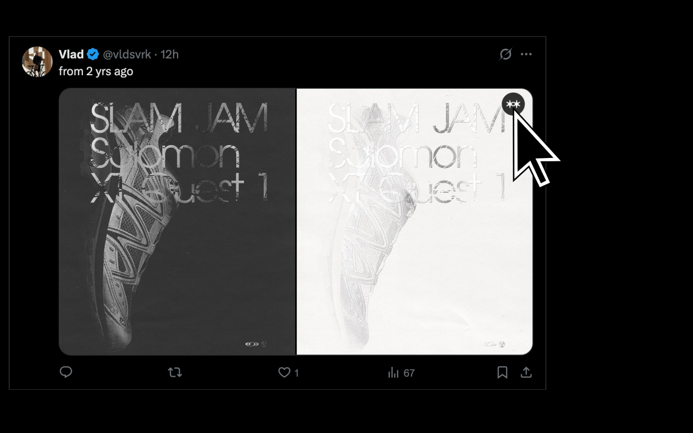
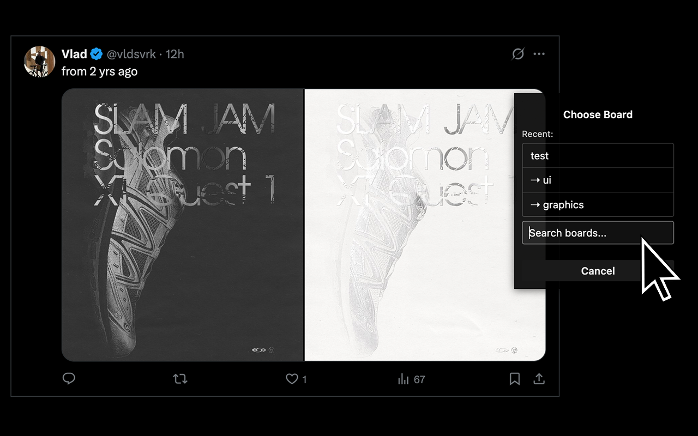

# Save to Are.na Browser Extension

A simple browser extension that allows you to quickly save images from any webpage to your Are.na boards.

## Description

This extension adds a small save icon ("**") when you hover over images on most websites. Clicking the icon initiates a process to save that image to one of your Are.na boards.



After clicking the save button, a board selector appears allowing you to choose where to save the image:



## Features

*   **Hover-to-Save:** An overlay appears on image hover, providing a quick save button.
*   **Are.na Authentication:** Securely connects to your Are.na account using OAuth 2.0 (Authorization Code flow). You only need to log in once.
*   **Board Selection UI:** After clicking the save button, a UI appears within the overlay allowing you to:
    *   View your 3 most recently updated Are.na boards (fetched initially when the list is empty).
    *   See the list update dynamically as you save items using the extension.
    *   Search for any of your boards by name.
*   **Visual Feedback:** The save button provides visual cues for loading, success (✅), failure (❌), and authentication required (🔑).

## Installation from GitHub

### Chrome/Edge
1. Download the latest `arena-clipper-chrome.zip` from the [Releases page](https://github.com/nic3rafs/arena-clipper/releases)
2. Extract the zip file
3. Open Chrome/Edge and navigate to `chrome://extensions` or `edge://extensions`
4. Enable "Developer mode"
5. Click "Load unpacked" and select the extracted folder

### Firefox
1. Download the latest `arena-clipper-firefox.zip` from the [Releases page](https://github.com/nic3rafs/arena-clipper/releases)
2. In Firefox, open `about:addons`
3. Click the gear icon and select "Install Add-on From File..."
4. Select the downloaded zip file

## Installation (Development)

To install this extension locally for development:

1. Clone or download this repository
2. Install dependencies: `pnpm install` or `npm install`
3. Start the development server:
   - For Chrome/Edge: `pnpm dev` or `npm run dev`
   - For Firefox: `pnpm dev:firefox` or `npm run dev:firefox`

This will automatically compile the TypeScript code and load the extension into your browser. The extension will reload when you make changes to the source code.


## Configuration

Before the authentication flow can work, you need to replace the placeholder Are.na Client ID:

1.  Register a new application with Are.na developers: [https://dev.are.na/oauth/applications](https://dev.are.na/oauth/applications)
2.  Set the "Redirect URI" for your application during registration. You can find the correct redirect URI for *your specific browser and installation* by:
    *   Loading the extension temporarily (as described above).
    *   Opening the background script console (see Debugging below).
    *   Looking for the log message `Are.na Background Redirect URL: ...` near the top. Copy this value exactly.
3.  Open the file `src/background.ts`.
4.  Find the line `const CLIENT_ID = "ZMhCuoCSLMPEEHAv-ouY1Lk36bTwV-iNbJkL_q7zAjs";` (or similar).
5.  Replace the placeholder string with your actual Client ID obtained from Are.na.
6.  **Important:** Reload the extension in your browser after making this change.

## Development & Project Structure

*   **Manifest Files:**
    *   `manifest.json`: Manifest V3 for Chrome/Edge.
    *   `manifest.firefox.json`: Manifest V2 for Firefox.
*   **Source Directory (`src/`):**
    *   `background.ts`: Handles authentication flow (OAuth) and securely provides the API token to content scripts.
    *   `arena-api.ts`: Module for interacting with the Are.na API (fetching user info, channels, saving blocks) and managing local storage for the API token and the recent boards list (`populateInitialRecentBoards`, `getRecentBoards`, `saveToBoard`, `searchArenaBoards`).
    *   `content/`: Scripts and styles injected into web pages.
        *   `core-overlay.ts`: Responsible for creating and managing the visual overlay (calculating position, creating save button with icon/status elements, handling hover/mouseout logic) and the board selector UI (displaying recent/search results, handling selection/cancel/click-outside).
        *   `arena-handler.ts`: Coordinates the user interaction flow triggered by the save button click. Manages button states (loading, success, error, etc.), orchestrates calls to `arena-api.ts` (ensuring token, populating initial recents, getting recents, saving), and invokes the `showBoardSelector` UI from `core-overlay.ts`.
    *   `style.css`: CSS styles for the injected UI elements (overlay, button, board selector, lists, input).
*   **Assets:** `arena-logo.svg`, `icon48.png`, `icon128.png`.

### Debugging

*   **Content Scripts:** Open the regular Developer Tools (F12) on any webpage where the extension is active. Logs from `core-overlay.ts` and `arena-handler.ts` will appear in the Console tab.
*   **Background Script:**
    *   **Chrome/Edge:** Go to `chrome://extensions` or `edge://extensions`, find the extension, and click the "service worker" link.
    *   **Firefox:** Go to `about:debugging#/runtime/this-firefox`, find the extension, and click the "Inspect" button.

## Building (Optional)

To create distributable `.zip` packages for each browser:

*   **Build for Chrome (Manifest V3):**
    ```bash
    pnpm run build:chrome
    # or
    npm run build:chrome
    ```
    This command will:
    1.  Clean the previous build output (`dist/` directory).
    2.  Run the TypeScript compiler (`tsc`) for type checking.
    3.  Run `vite build` using `manifest.json`.
    4.  Create a `arena-clipper-chrome.zip` file in the project root containing the built extension.

*   **Build for Firefox (Manifest V2):**
    ```bash
    pnpm run build:firefox
    # or
    npm run build:firefox
    ```
    This command will:
    1.  Clean the previous build output (`dist/` directory).
    2.  Run the TypeScript compiler (`tsc`) for type checking.
    3.  Run `vite build` using `manifest.firefox.json` (via the `BROWSER=firefox` environment variable).
    4.  Create a `arena-clipper-firefox.zip` file in the project root containing the built extension.

These `.zip` files are suitable for uploading to the Chrome Web Store and Mozilla Add-ons (AMO) respectively.

## License

This project is licensed under the Creative Commons Attribution-NonCommercial 4.0 International License (CC BY-NC 4.0).

This means you are free to:
- Share — copy and redistribute the material in any medium or format
- Adapt — remix, transform, and build upon the material

Under the following terms:
- Attribution — You must give appropriate credit, provide a link to the license, and indicate if changes were made
- NonCommercial — You may not use the material for commercial purposes

For the full license text, see [CC BY-NC 4.0](https://creativecommons.org/licenses/by-nc/4.0/legalcode).

## Author

- Twitter: [@vldsvrk](https://x.com/vldsvrk)
- Website: [vladsavruk.com](https://vladsavruk.com)
